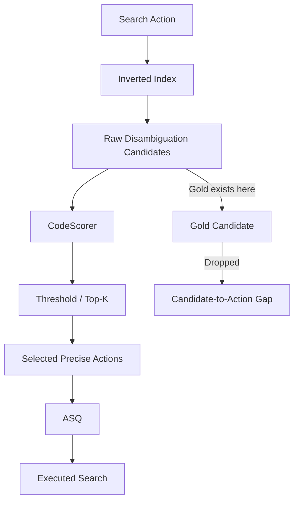

# OrcaLoca Candidate-to-Action Gap 实验

本仓库是一个围绕 OrcaLoca **Candidate-to-Action information loss** 的独立实验与分析仓库，不是 OrcaLoca 原项目的再次发布。

## 简明结论

我们研究 OrcaLoca 在 disambiguation 阶段已经召回 gold entity 后，是否会因为 `CodeScorer`、threshold 或 top-k 筛选，导致没有生成对应的 precise search action。

在 SWE-bench Common 的本次运行中观察到：

- 93 个实例全部完成；
- 22 个 ranked disambiguation events；
- 7 个事件的 `raw_candidates` 已包含 gold entity；
- 其中 3 个没有生成对应的 precise action；
- Candidate-to-Action Gap Rate = `3 / 7 = 42.86%`；
- 3 个 Gap 全部发生在 threshold 阶段，未观察到 top-k 或 action generation 阶段的 Gap。

这证明当前实现中确实存在 candidate-to-action information loss，但不能据此声称它一定导致最终 repair failure。

## 1. 研究背景

OrcaLoca 会先使用搜索工具召回可能的函数、方法或类。当一个查询对应多个函数/方法时，系统会进入 disambiguation ranking：对候选进行 `CodeScorer` 打分，再通过 threshold 和 top-k 生成更精确的检查动作。

本仓库只研究这条转换链上的信息是否丢失：

```text
raw candidate → scorer score → threshold/top-k → selected precise action
```

## 2. 研究问题

核心问题是：

> 当 gold function/method 已经进入 raw disambiguation candidates 时，OrcaLoca 是否会在 `_disambiguation_ranking` 中将它过滤掉，从而不生成对应的 precise search action？

本实验把 Gap Event 定义为：

```text
gold ∈ raw_candidates
AND
gold ∉ selected_actions
```

主指标为：

```text
Candidate-to-Action Gap Rate
= # Gap Events / # Gold-Available Disambiguation Events
```

分母不是 93，也不是全部 disambiguation events，而是 gold 已经出现在 ranked raw candidates 中的事件数。

## 3. OrcaLoca 中的 Disambiguation 流程



本次观测重点是图中的 `C → D → E → F`，不是重新设计 OrcaLoca 的搜索或评分方法。

## 4. Candidate-to-Action Gap 定义

对每个 ranked callable/method event，离线构造：

- `G`：当前 instance 的 patch-derived gold callable entities；
- `C`：事件中的 `raw_candidates`；
- `A`：事件中 `selected_actions` 对应的 canonical entities。

当 `G ∩ C` 非空时，该事件是 gold-available；当 `(G ∩ C) ∩ A` 为空时，该事件是 Gap Event。`search_class` 和 `search_file_contents` 事件单独记录，但不进入主 Gap 分母，因为它们不经过 CodeScorer ranking。

## 5. 数据集

使用 OrcaLoca 原有的 `SWE-bench_common` 加载逻辑，即：

```text
SWE-bench Common = SWE-bench Lite ∩ SWE-bench Verified
```

本次验证 `len(dataset) == 93`，完整 instance 列表保存在 [`common93_instance_ids.txt`](artifacts/common93_candidate_action_gap/common93_instance_ids.txt)。

## 6. 实验设计

- 不修改 `CodeScorer`、prompt、model、temperature、priority 或 ASQ；
- 不修改 `score_threshold=75` 或 `top_k_disambiguation=3`；
- 只在 `_disambiguation_ranking` 记录剪枝前候选、score、threshold 后候选和生成 action；
- gold 只在运行结束后通过 patch-derived artifacts 离线 join，live agent 不读取 gold；
- Common93 运行完成后再进行离线统计和源码人工核验；
- 当前仓库不保存 API key、token、`.env` 或 Docker 数据。

完整运行参数见 [`run_config.json`](artifacts/common93_candidate_action_gap/run_config.json)，方法说明见 [`docs/methodology.md`](docs/methodology.md)。

## 7. 实验结果

| Instance | Query | Gold Entity | Gold Score | Threshold | Selected | Gap | Drop Stage |
|---|---|---|---:|---:|---|---|---|
| `matplotlib__matplotlib-23299` | `rc_context` | `lib/matplotlib/__init__.py::rc_context` | 72 | 75 | No | Yes | threshold |
| `scikit-learn__scikit-learn-14894` | `_sparse_fit` | `sklearn/svm/base.py::BaseLibSVM::_sparse_fit` | 95 | 75 | Yes | No | - |
| `sympy__sympy-12419` | `_entry` | `sympy/matrices/expressions/matexpr.py::Identity::_entry` | 95 | 75 | Yes | No | - |
| `sympy__sympy-13031` | `row_join` | `sympy/matrices/sparse.py::MutableSparseMatrix::row_join` | 75 | 75 | No | Yes | threshold |
| `sympy__sympy-13647` | `entry` | `sympy/matrices/common.py::MatrixShaping::entry` | 75/70/60 | 75 | No | Yes | threshold |
| `sympy__sympy-16792` | `routine` | `sympy/utilities/codegen.py::CodeGen::routine` | 90 | 75 | Yes | No | - |
| `sympy__sympy-24066` | `_collect_factor_and_dimension` | `sympy/physics/units/unitsystem.py::UnitSystem::_collect_factor_and_dimension` | 95 | 75 | Yes | No | - |

汇总：

```text
ranked disambiguation events = 22
gold-available events         = 7
gap events                    = 3
Gap Rate                      = 3 / 7 = 42.86%

threshold                     = 3
top-k                         = 0
action generation             = 0
```

机器可读结果在 [`summary.json`](artifacts/common93_candidate_action_gap/summary.json)，详细候选和 score 在 [`detailed_gold_available_events.md`](artifacts/common93_candidate_action_gap/detailed_gold_available_events.md)，汇总解释在 [`docs/results.md`](docs/results.md)。

## 8. Gap 案例分析

三件 Gap 均通过 patch-derived gold metadata 和对应 base commit 的源码人工核验：

1. `matplotlib__matplotlib-23299`：`rc_context` score 72，rank 1，低于 75；
2. `sympy__sympy-13031`：`MutableSparseMatrix::row_join` score 75，rank 2；非 gold 的 `NewMatrix::row_join` score 85 被选中；
3. `sympy__sympy-13647`：嵌套的 `MatrixShaping::_eval_col_insert::entry` 出现多个 canonical candidate，最佳 score 75，因严格 threshold 被过滤。

完整人工审计见 [`manual_audit.md`](artifacts/common93_candidate_action_gap/manual_audit.md) 和 [`docs/gap_cases.md`](docs/gap_cases.md)。

## 9. 后续 Trace 分析

在保存的 diagnostic event stream 中，3 个 Gap 都没有后续 exact gold action：

```text
later exact gold action observed = 0 / 3
no later exact gold action in saved diagnostic stream = 3 / 3
observed later-recovered cases = 0 / 3
```

不过，本次 artifacts 没有持久化完整 `action_history`、所有 tool-call payload 或每个 action 的执行回执。因此只能说“当前保存的诊断流中未观察到后续 exact gold action”，不能断言 gold 永久丢失。Action-to-Execution Gap 也无法从现有产物可靠计算。详见 [`docs/trace_analysis.md`](docs/trace_analysis.md)。

## 10. 仓库结构

```text
.
├── README.md
├── docs/
│   ├── methodology.md
│   ├── results.md
│   ├── gap_cases.md
│   ├── trace_analysis.md
│   └── code_changes.md
├── artifacts/common93_candidate_action_gap/
│   ├── summary.json
│   ├── summary.md
│   ├── disambiguation_events.jsonl
│   ├── gold_available_events.jsonl
│   ├── gap_events.jsonl
│   ├── gold_entities.json
│   ├── common93_instance_ids.txt
│   ├── run_config.json
│   └── manual_audit.md
├── scripts/
│   ├── analyze_gap.py
│   └── build_gold_entities.py
├── patches/
│   └── orcaloca_gap_logging.patch
└── upstream_orcaloca/
    ├── README.md
    └── Orcar/, dataset/, evaluation/, tests/, ...
```

原 OrcaLoca 源码保留在 `upstream_orcaloca/`，作为可追溯的 upstream snapshot；仓库首页和主要文档不再以它为主体。

## 11. 如何复现

### 11.1 只做离线分析

不需要 API：

```bash
python3 scripts/analyze_gap.py \
  --artifact-dir artifacts/common93_candidate_action_gap
```

### 11. 重新构造 gold entities

这不是本次已完成实验的一部分。需要外部数据集缓存和目标仓库 checkout；运行前将 upstream snapshot 加入 Python path：

```bash
PYTHONPATH=upstream_orcaloca python3 scripts/build_gold_entities.py \
  --dataset SWE-bench_common \
  --repo-root /path/to/repositories \
  --output-dir /path/to/artifacts
```

### 11. 重新运行 Agent

当前仓库不提供 secret。若未来需要重跑，应在仓库外配置 OpenAI-compatible provider、model、base URL 和 API key，并使用 `run_config.json` 中记录的非 secret 参数；不要将凭据写入仓库或日志。

## 12. 与原始 OrcaLoca 的关系

原始项目快照在 [`upstream_orcaloca/`](upstream_orcaloca/)，原始 README 保存在 [`upstream_orcaloca/ORIGINAL_README.md`](upstream_orcaloca/ORIGINAL_README.md)。本实验以 OrcaLoca 的原始 ranking 行为为对象，仅增加观测日志和必要的运行兼容 plumbing。

差异说明和可审阅 patch 见 [`docs/code_changes.md`](docs/code_changes.md) 与 [`patches/orcaloca_gap_logging.patch`](patches/orcaloca_gap_logging.patch)。

## 13. 当前结论与限制

当前结论是：在 Common93 本次运行中，共有 7 个 gold 已进入 ranked disambiguation raw candidates 的事件，其中 3 个没有转化为对应 precise action；3 个均由 threshold 过滤造成。

不能将 `42.86%` 表述为 OrcaLoca 所有搜索都会丢失 gold 的比例。当前分母只有 7 个 gold-available events，样本事件数较少；仍需更大样本或 intervention 实验判断普遍性和 downstream 因果影响。

本实验没有验证：

```text
action → execution → final localization → repair patch → resolved
```

因此不能声称 Candidate-to-Action Gap 已经导致最终 repair failure。
